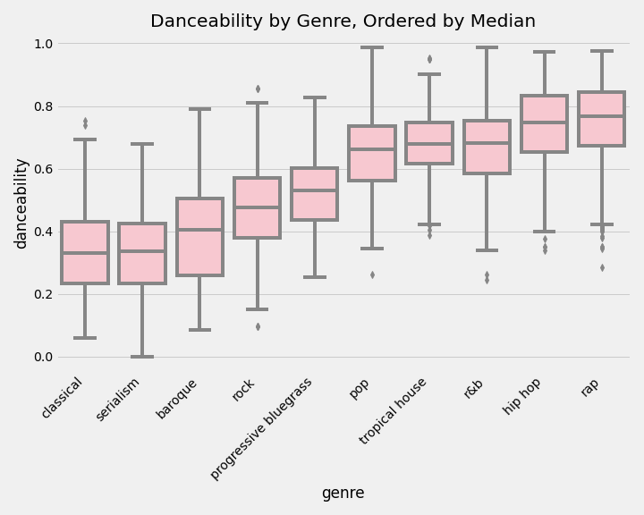
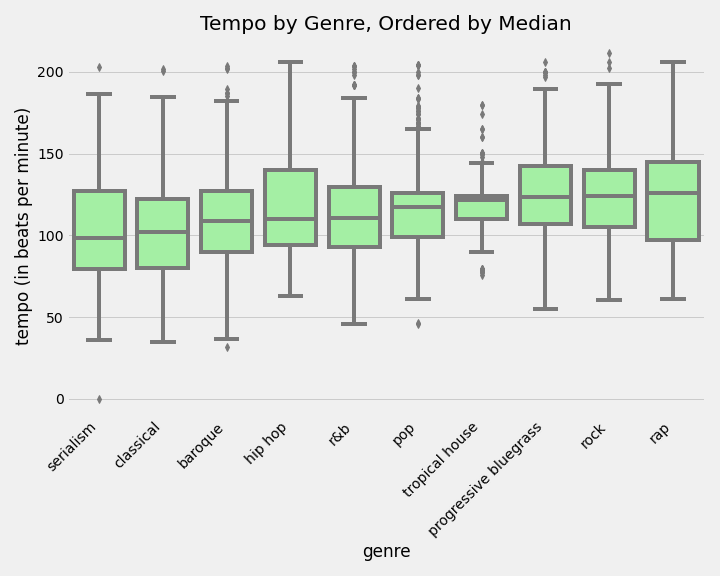
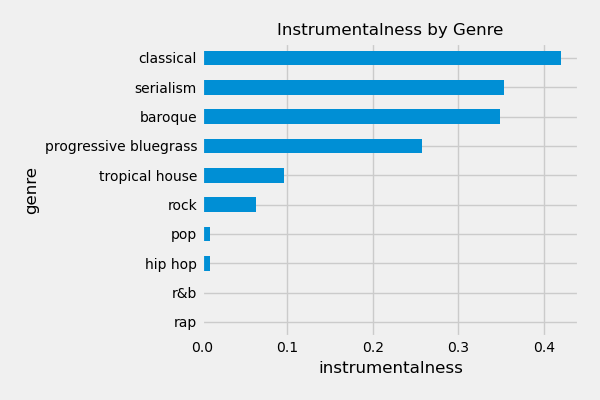
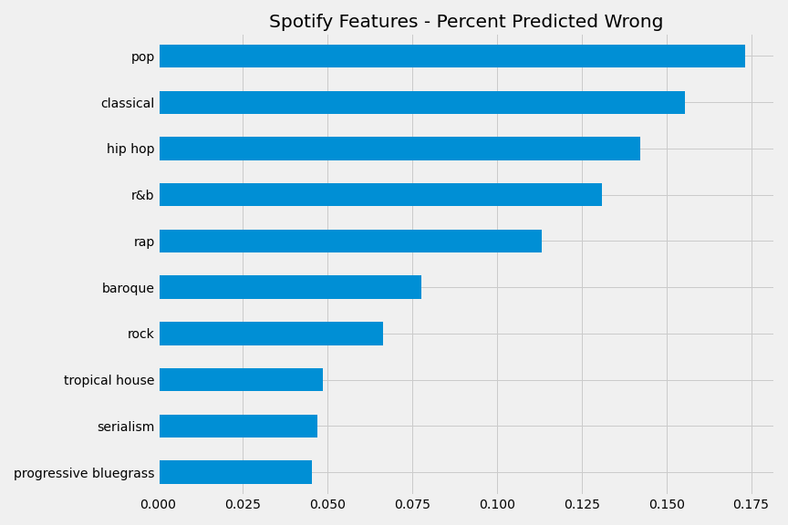
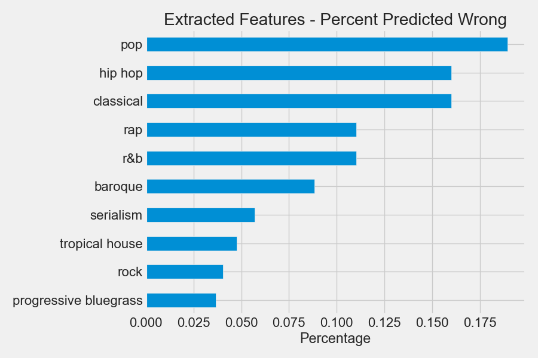
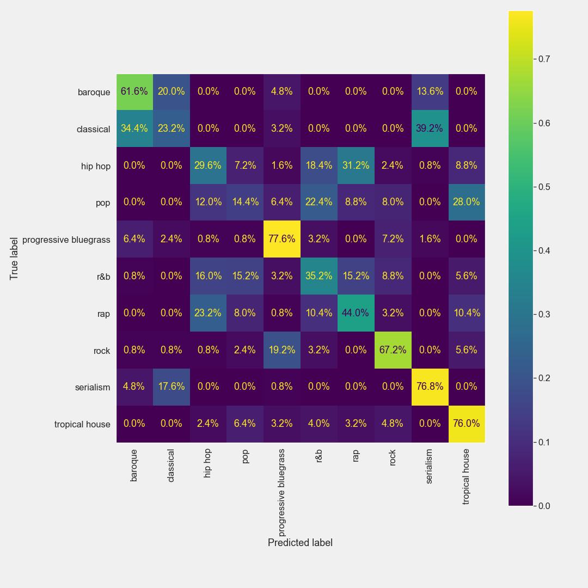

## **Genre Classification**

I've chosen to build a genre classifier! This project has the most readily available data (scraping Spotify using the `spotipy` library).

## **Problem Statement**

Using features derived from an audio source itself, can a classification model predict the genre of a 30-second audio clip with high enough accuracy to organize new songs into their respective genres?

Classifying genre is important for music distribution and streaming platforms, it also helps listeners find new bands they might like, and it, in turn, helps musicians connect with new audiences.

My goal is to be able to predict genre using **features derived from the audio signal** to classify genre. This could be helpful for building playlists algorithmically without needing humans to manually input data, and can help artists assign their music to all the genres that their music fits the description of.

**The metric for success here is accuracy**--any incorrect response is a bad one.

### **Data Collection**

Scraping 30-second song samples using `spotipy` - I will start with 5 general genres and dig down into the subgenres of each:

* Original 5 Genres:
  * Classical
  * Progressive Bluegrass
  * Rock
  * Rap
  * R & B  

   
* Extra 5 Genres:
 * Tropical House
 * Pop
 * Baroque
 * Serialism
 * Hip Hop
 
I ended up with **9365 unique songs** and wanted to have 500 songs from each of the above genres for my classification model.
 
Note that after my first round of modeling, I was getting about 84% accuracy with the original 5 genres. With classical, **I was getting 95% accuracy.** I included Baroque, Serialism, and Ambient in the additional set of 5 genres to test the suspicion that Classical was easier to predict **because it was quieter** than the other 4 original genres. Baroque and Serialism are subsets of classical music. The **Baroque period is from approximatlely the 1600s-1800s** (there's debate about the blurry start and end, but it's not particularly important here). **Serialism is a subset of classical music emerging in the 20th century**. If my model can continue to predict between classical, baroque, and serialism well given these closely-related genres, I'd be very impressed!

Similarly, I included Tropical House and Folk to try to add genres closely related to the Rap and Progressive Bluegrass genres, respectively. Unfortunately, Folk didn't have enough unique songs to meet my threshold of at least 500 unique songs before sampling.

### **Data Dictionary**

The dataset used for modeling contains [features from Spotify](https://developer.spotify.com/documentation/web-api/reference/tracks/get-several-audio-features/) and newly-extracted features extracted from the music:

| **Feature Name**   | **Type**          | **Description**                                                                                                                                                                                                                                                                                                                                                                                                                                                                                                                         |
|:--------------------|:-------------------|:----------------------------------------------------------------------------------------------------------------------------------------------------------------------------------------------------------------------------------------------------------------------------------------------------------------------------|
| `id`               | string            | The unique id for each song (you may see duplicates in the dataset because there are multiple genres per song)                                                                                                                                                                                                                                                                                                                                                                                                                          |
| `genre`            | string            | Genre (seems to be connected to artist)                                                                                                                                                                                                                                                                                                                                                                                                                                                                                                 |
| `track_name`       | string            | Name of the song                                                                                                                                                                                                                                                                                                                                                                                                                                                                                                                        |
| `preview_url`      | string            | Url where you can listen to a 30-second sample of the song                                                                                                                                                                                                                                                                                                                                                                                                                                                                              |
| `location`         | string            | Relative path of the song                                                                                                                                                                                                                                                                                                                                                                                                                                                                                                               |
| `filename`         | string            | Filename of the song within project directory                                                                                                                                                                                                                                                                                                                                                                                                                                                                                           |
| `artist`           | string            | Artist on the song                                                                                                                                                                                                                                                                                                                                                                                                                                                                                                                      |
| `artist_uri`       | string            | Artist uri (Spotify's unique id for the artist)                                                                                                                                                                                                                                                                                                                                                                                                                                                                                         |
| `album`            | string            | Album containing the song                                                                                                                                                                                                                                                                                                                                                                                                                                                                                                               |
| `release_date`     | string            | Date when the song was initially released                                                                                                                                                                                                                                                                                                                                                                                                                                                                                               |
| `danceability`     | float             | SPOTIFY FEATURE: Danceability describes how suitable a track is for dancing based on a combination of musical elements  including tempo, rhythm stability, beat strength, and overall regularity. A value of 0.0 is least  danceable and 1.0 is most danceable.                                                                                                                                                                                                                                                                         |
| `energy`           | float             | SPOTIFY FEATURE: Energy is a measure from 0.0 to 1.0 and represents a perceptual measure of intensity and activity.  Typically, energetic tracks feel fast, loud, and noisy. For example, death metal has high energy,  while a Bach prelude scores low on the scale. Perceptual features contributing to this attribute include dynamic range,  perceived loudness, timbre, onset rate, and general entropy.                                                                                                                           |
| `key`              | int               | SPOTIFY FEATURE: The key the track is in. Integers map to pitches using standard Pitch Class notation .  E.g. 0 = C, 1 = C♯/D♭, 2 = D, and so on.                                                                                                                                                                                                                                                                                                                                                                                       |
| `loudness`         | float             | SPOTIFY FEATURE: The overall loudness of a track in decibels (dB). Loudness values are averaged across the entire track  and are useful for comparing relative loudness of tracks. Loudness is the quality of a sound that is the  primary psychological correlate of physical strength (amplitude). Values typical range between -60 and 0 db.                                                                                                                                                                                         |
| `mode`             | int               | SPOTIFY FEATURE: Mode indicates the modality (major or minor) of a track, the type of scale from which its melodic content is derived. Major is represented by 1 and minor is 0.                                                                                                                                                                                                                                                                                                                                                        |
| `speechiness`      | float             | SPOTIFY FEATURE: Speechiness detects the presence of spoken words in a track. The more exclusively speech-like the recording  (e.g. talk show, audio book, poetry), the closer to 1.0 the attribute value. Values above 0.66 describe tracks  that are probably made entirely of spoken words. Values between 0.33 and 0.66 describe tracks that may contain both  music and speech, either in sections or layered, including such cases as rap music. Values below 0.33 most likely  represent music and other non-speech-like tracks. |
| `acousticness`     | float             | SPOTIFY FEATURE: A confidence measure from 0.0 to 1.0 of whether the track is acoustic. 1.0 represents high confidence the track is acoustic.                                                                                                                                                                                                                                                                                                                                                                                           |
| `instrumentalness` | float             | SPOTIFY FEATURE: Predicts whether a track contains no vocals. “Ooh” and “aah” sounds are treated as instrumental in this context.  Rap or spoken word tracks are clearly “vocal”. The closer the instrumentalness value is to 1.0, the greater likelihood  the track contains no vocal content. Values above 0.5 are intended to represent instrumental tracks, but confidence is  higher as the value approaches 1.0.                                                                                                                  |
| `liveness`         | float             | SPOTIFY FEATURE: Detects the presence of an audience in the recording. Higher liveness values represent an increased probability that  the track was performed live. A value above 0.8 provides strong likelihood that the track is live.                                                                                                                                                                                                                                                                                               |
| `valence`          | float             | SPOTIFY FEATURE: A measure from 0.0 to 1.0 describing the musical positiveness conveyed by a track. Tracks with high valence sound  more positive (e.g. happy, cheerful, euphoric), while tracks with low valence sound more negative (e.g. sad, depressed, angry).                                                                                                                                                                                                                                                                     |
| `tempo`            | int               | SPOTIFY FEATURE: The overall estimated tempo of a track in beats per minute (BPM). In musical terminology, tempo is the speed or pace of a  given piece and derives directly from the average beat duration.                                                                                                                                                                                                                                                                                                                            |
| `energy_calc`      | array-like object | NEWLY EXTRACTED FEATURE: Total magnitude of the signal at different windows of time. Note this is not the same as Spotify's energy feature                                                                                                                                                                                                                                                                                                                                                                                                                                                  |
| `rms_calc`         | array-like object | NEWLY EXTRACTED FEATURE: Root Mean Squared Energy, measure of loudness across different windows of time                                                                                                                                                                                                                                                                                                                                                                                                                                 |
| `mfcc_calc`        | array-like object | NEWLY EXTRACTED FEATURE: Multi-step calculation used to create a non-linear representation of a sound's spectral envelope                                                                                                                                                                                                                                                                                                                                                                                                               |
| `mean_energy`      | float             | NEWLY EXTRACTED FEATURE: Mean of the `energy_calc` feature                                                                                                                                                                                                                                                                                                                                                                                                                                                                              |
| `std_energy`       | float             | NEWLY EXTRACTED FEATURE: Standard Deviation of the `energy_calc` feature                                                                                                                                                                                                                                                                                                                                                                                                                                                                |
| `min_energy`       | float             | NEWLY EXTRACTED FEATURE: Minimum of the `energy_calc` feature                                                                                                                                                                                                                                                                                                                                                                                                                                                                           |
| `max_energy`       | float             | NEWLY EXTRACTED FEATURE: Maximum of the `energy_calc` feature                                                                                                                                                                                                                                                                                                                                                                                                                                                                           |
| `mfcc_mean`        | array-like object | NEWLY EXTRACTED FEATURE: Mean of the `mfcc_calc` feature, still contains an array of filters at each window                                                                                                                                                                                                                                                                                                                                                                                                                             |
| `mfcc_std`         | array-like object | NEWLY EXTRACTED FEATURE: Standard deviation of the `mfcc_calc` feature, still contains an array of filters at each window                                                                                                                                                                                                                                                                                                                                                                                                               |
| `mfcc_min`         | array-like object | NEWLY EXTRACTED FEATURE: Minimum of the `mfcc_calc` feature, still contains an array of filters at each window                                                                                                                                                                                                                                                                                                                                                                                                                          |
| `mfcc_max`         | array-like object | NEWLY EXTRACTED FEATURE: Maximum of the `mfcc_calc` feature, still contains an array of filters at each window                                                                                                                                                                                                                                                                                                                                                                                                                          |
| `max_rms`          | float             | NEWLY EXTRACTED FEATURE: Mean of the `rms_calc` feature                                                                                                                                                                                                                                                                                                                                                                                                                                                                                 |
| `std_rms`          | float             | NEWLY EXTRACTED FEATURE: Standard Deviation of the `rms_calc` feature                                                                                                                                                                                                                                                                                                                                                                                                                                                                   |
| `median_rms`       | float             | NEWLY EXTRACTED FEATURE: Median of the `rms_calc` feature                                                                                                                                                                                                                                                                                                                                                                                                                                                                               |
| `min_rms`          | float             | NEWLY EXTRACTED FEATURE: Min of the `rms_calc` feature                                                                                                                                                                                                                                                                                                                                                                                                                                                                                  |

### **EDA**

  
  

### **Methods for cleaning and preprocessing data**

Using mostly the `librosa` library along with existing techniques gleaned from the [Music information retrieval](https://musicinformationretrieval.com/index.html) community, I'll use various methods for extracting features from the music itself. The methods I use to extract features from the audio are:
* `Energy and Root Mean Squared Energy (RMSE)` - energy and RMSE are different measurements of loudness, can be measured in windows across a 30-sec range
* `Fast Fourier Transform (fft)` - converting a time-window of an audio source into a snapshot of the frequency spectrum
* `Mel Frequency Cepstral Coefficients (mfcc)` - Creates overlapping bins along the log frequency spectrum and stores the power of each of those bins across windows of time.

Notes for recreating results:
* When extracting new features, I consistently used the following variables:
  * `nfilt` (number of filters for mfcc calculation) - 12
  * `frame_length` (number of samples for each frame/window to make calculations on) - 512
  * `hop_length` (the number of samples to hop through before making a calculation) - 256
* When setting up my Convolutional Neural Net, I had to shorten every song sample to 2584 frames. It seems that a few songs had previews of more than 30-seconds.

### **Models**

I tested out **Support Vector Machines** and **Convolutional Neural Networks**, they seem to get good results when dealing with audio classification problems, in general. Audio signal can be converted into images using the above preprocessing steps.[1] Ultimately, I went with a `SVC` model as my production model. The `SVC` model performed better and ran faster than the CNN.

## **Results**

My best performing models were `SVC` models with varying C values tuned to minimize overfitting (5% tolerance for overfitting). 

| Model type    |   Number of Genres    |   Acc (Spotify Features) |   Acc (Extracted features)|  
|---------------|-------------------------|----------------------|-----------------------|
|     SVC       |     5                   |     78.4%            |     84.2%             |
|     SVC       |     10                  |     50.6%            |     56.5%             |

#### Percentage of incorrect classifications per genre using **Spotify's features** on 5 genres

| Genre                     | Percent_of_wrong_predictions |
|---------------------------|------------------------------|
| rap                       | 31.94                        |
| r&b                       | 26.39                        |
| rock                      | 20.14                        |
| progressive bluegrass     | 13.19                        |
| classical                 | 8.33                         |

#### Percentage of incorrect classification per genre using **my extracted features** on 5 genres

| Genre                 | pct_predicted_wrong |
|-----------------------|---------------------|
| r&b                   | 33.33               |
| rap                   | 25.49               |
| progressive bluegrass | 18.62               |
| rock                  | 16.66               |
| classical             | 5.88                |

#### Percentage of incorrect classifications per genre using **Spotify's features** on 10 genres

#### Percentage of incorrect classifications per genre using **my extracted features** on 10 genres

#### Extracted Features Confusion Matrix

## **Conclusions**

* My models using extracted MFCCs outperform models using spotify's features.
* When subgenres are present, a false prediction by the model tends to fall within related genres. For example: classical, baroque, and serialism were the most likely to be confused for each other, but those all fit under the umbrella of classical.
* Because the model tends to predict well on more general genres (like the 5-genre model), this could beneficial for auto-generating recommended metadata for artists. **It would still need some human input** to better train, since an incorrect prediction here would lead to potential lost revenue for artists and unpleasant listening experiences for users (users might expect one genre but hear another).
* Further exploration needs to be done to figure out why the subgenres are being classified together - OR this could be an interesting way to find intersections between genres that are sonically adjacent to each other.
* If sub-genres are getting confused for each other, are there other factors that go into assigning sub-genre (What geographic location was it written? What are the lyrics about? When was it written?)

## **Future Steps**

* Optimize the preprocessing steps (librosa still loads files quite slowly, it seems)
* Include more genres/subgenres
* Extract more features from the music: Tempo, pitch content, instrument types?
* Run some unsupervised learning to see what clusters develop
* Deploy a web app that will tell you the genre of a song - useful for generating automatic metadata